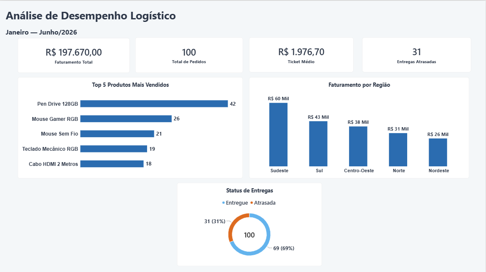
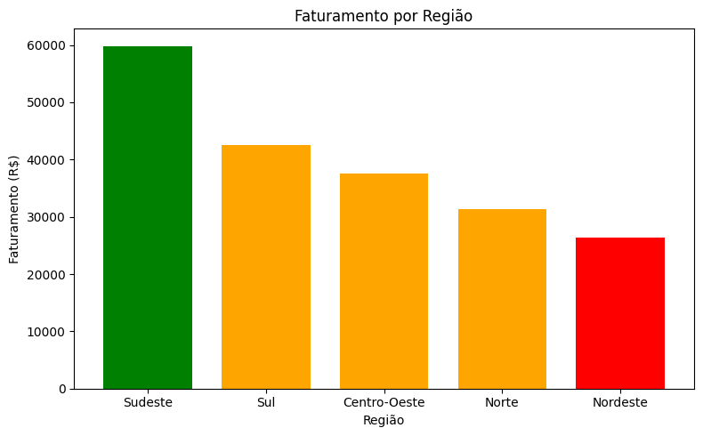
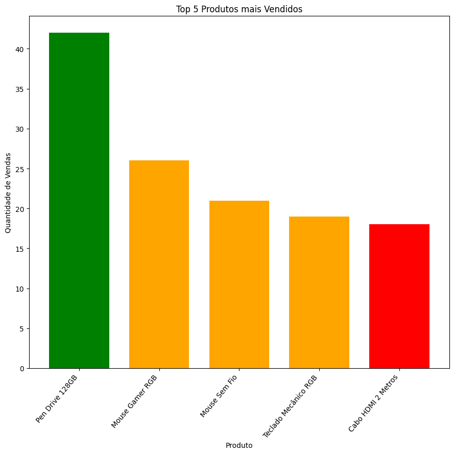
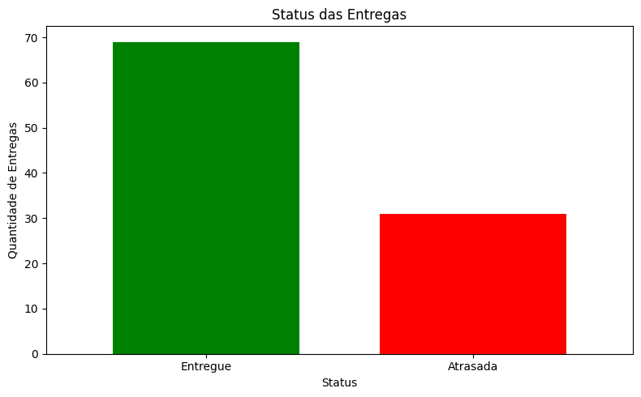

# Análise de Dados de Logística


## Sobre o Projeto

Projeto desenvolvido para explorar dados relacionados a vendas e operações logísticas.

São utilizados dados fictícios de produtos, clientes, pedidos e entregas para analisar faturamento, produtos mais vendidos, desempenho por região e situação das entregas.

A análise foi realizada com **Python** e posteriormente utilizada na construção de um dashboard no **Power BI**.

Foi desenvolvido com finalidade educacional e de portfólio, visando praticar análise exploratória, manipulação de dados, visualização e construção de dashboards.

---

## Demonstração

### Dashboard de Logística



*Dashboard desenvolvido no Power BI com os principais indicadores da análise.*

---

### Faturamento por Região



*Distribuição do faturamento entre as regiões.*

---

### Produtos Mais Vendidos



*Produtos com maior quantidade de unidades vendidas.*

---

### Status das Entregas



*Distribuição das entregas entre os diferentes status.*

---

## Funcionalidades

- Análise de faturamento e ticket médio.
- Identificação dos produtos mais vendidos.
- Análise de faturamento por região.
- Análise do status e dos atrasos nas entregas.
- Criação de visualizações e dashboard no Power BI.

---

## Tecnologias e Ferramentas

- Python
- Pandas
- NumPy
- Matplotlib
- Jupyter Notebook
- OpenPyXL
- Excel
- Power BI
- DAX
- Visual Studio Code

---

## Conceitos Aplicados

- Análise exploratória de dados.
- Manipulação e transformação de dados.
- Visualização de dados.
- Modelagem de dados e criação de medidas DAX.

---

## Estrutura do Projeto

```text
analise-de-dados-de-logistica/
│
├── dados/
│   └── dataset-dados-de-logistica.xlsx
│
├── documentacao/
│   ├── planejamento.md
│   ├── metodologia.md
│   └── resultados.md
│
├── imagens/
│   ├── imagem-dashboard-de-analise-de-logistica.png
│   ├── visualizacao-faturamento-por-regiao.png
│   ├── visualizacao-produtos-vendidos.png
│   └── visualizacao-status-entregas.png
│
├── power-bi/
│   └── dashboard-de-analise-de-logistica.pbix
│
└── python/
    ├── analise-exploratoria.ipynb
    └── analise-visualizacoes.ipynb
```

---

## Como Executar

### 1. Clone o repositório

```bash
git clone https://github.com/Ana-BeatrizSilva/analise-de-dados-de-logistica.git
```

### 2. Acesse a pasta do projeto

```bash
cd analise-de-dados-de-logistica
```

### 3. Execute os notebooks

Abra os arquivos `.ipynb` da pasta `python/` utilizando o **Jupyter Notebook** ou **Visual Studio Code**.

---

## Possíveis Melhorias Futuras

- Adicionar novas análises e indicadores ao dashboard.
- Automatizar a atualização dos dados.
- Integrar os dados a um banco de dados.
